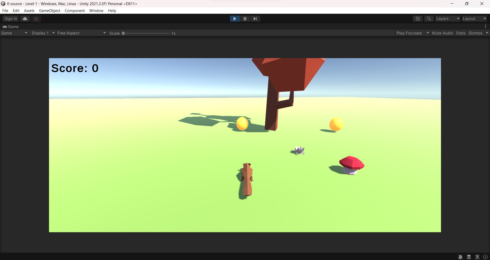
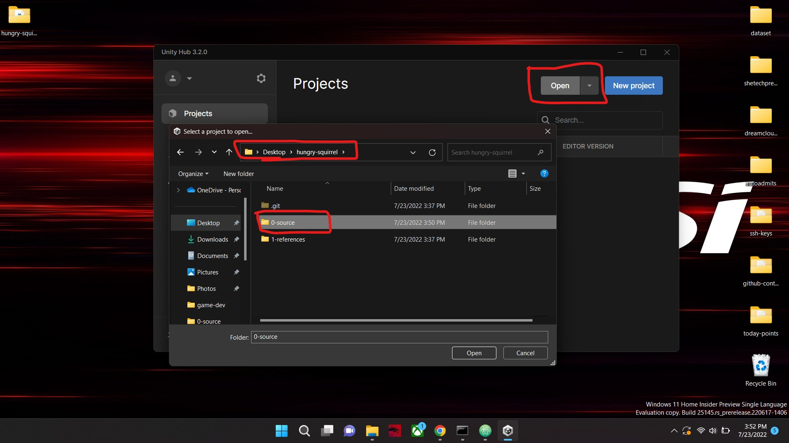

# Hungry Squirrel

## Introduction

Welcome to  Hungry Squirrel, a simple yet challenging 3D game that takes you on an adventure as a hungry squirrel wanders for food to be survived, struggling to survive in the forest. The game is built using Unity, a widely-used game engine, and programmed with Unity's visual scripting tool, providing a seamless and engaging gaming experience.

As the squirrel, you must navigate through the beautifully rendered forest environment for food, such as acorns, berries, and other nourishments, to sustain your survival. However, you must also beware of other animals in the forest.

Hungry Squirrel is a perfect game for both seasoned gamers and those new to 3D gaming. The game offers a fun and immersive experience as you embark on a thrilling journey through the forest and fight to survive as a squirrel. We invite you to grab your controller and join us on this exciting adventure.





## Technology and Frameworks

- Unity Editor 2021.3.5f1 or higher

## Open Project

```
hungry-squirrel\0-source

```

- Open the 0-source folder in unity editor,



## Demo


## Acknowledgement

This simple game was built by [Jason Bond](https://www.linkedin.com/in/jasonrtbond/), a professional game developer and AR/VR/MR Specialist, and [Gunarakulan Gunaretnam](https://www.linkedin.com/in/gunarakulangunaretnam/) (Me), is an interdisciplinary tech consultant who deeply engages in engineering, research, innovation, and entrepreneurship.


# Contact

### Website: 

[](https://www.gunarakulan.info)

### Social Media:

[](https://www.linkedin.com/in/gunarakulangunaretnam)
[](https://www.facebook.com/gunarakulangunaretnam)
[](https://wa.me/94740001141?text=WhatsApp%3A%20%2B9740001141)
[](https://www.instagram.com/gunarakulangunaretnam)
[](https://x.com/gunarakulangr)
[](https://www.kaggle.com/gunarakulangr)
[](https://www.tiktok.com/@gunarakulangunaretnam)
[](https://www.youtube.com/channel/UCjMOdgHFAjAdBKiqV8y2Tww)
